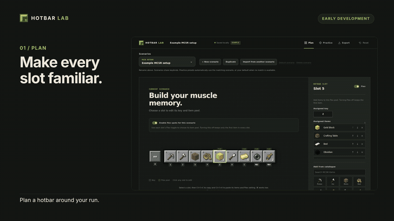
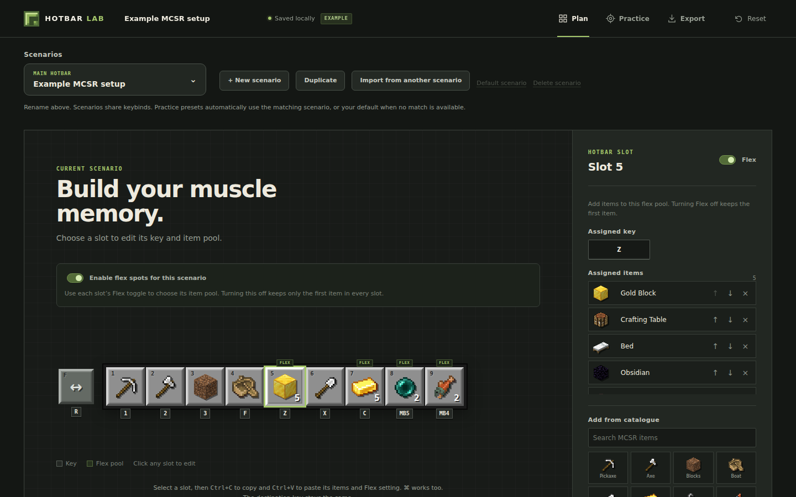
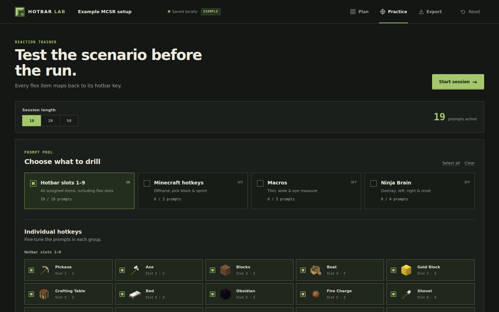
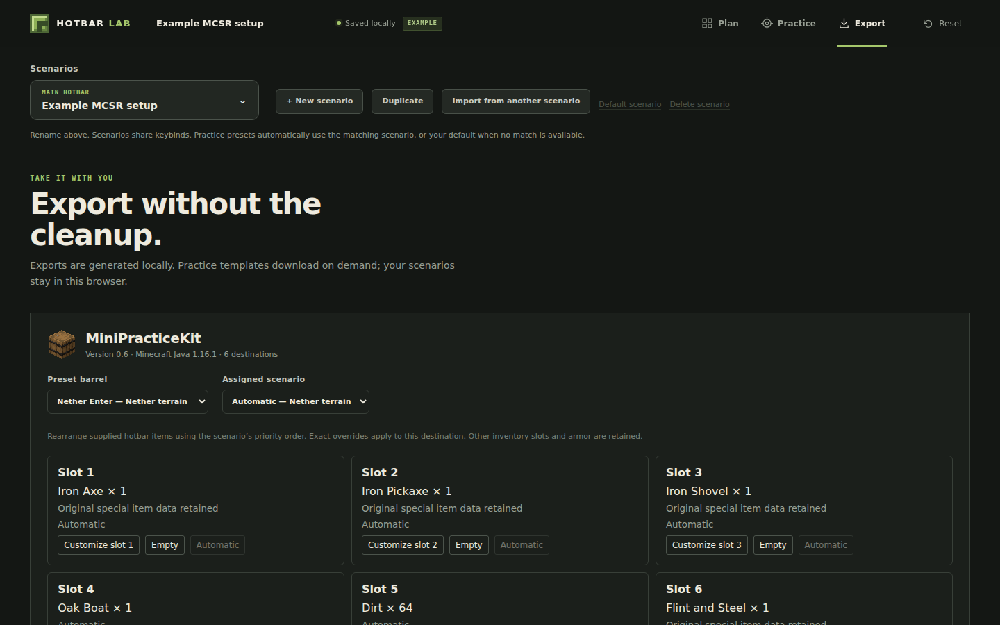

> [!WARNING]
> **Very early stage — expect rough edges.** Hotbar Lab is under active development. Features, exports, and saved-data formats may change. Back up your Minecraft files before replacing them, and try practice exports in a separate instance first.

# Hotbar Lab

**Plan your hotbar. Practice your keys. Take it into Minecraft.**

A browser-based hotbar planner, reaction trainer, and practice exporter for Minecraft speedrunners. Build a setup that fits your run, rehearse it, and carry it into **Minecraft Java 1.16.1**.

**[Try Hotbar Lab →](https://hotbarlab.com)** · [How to use](#how-to-use) · [Develop locally](#develop-locally) · [Report a bug](https://github.com/minhtrinh06/hotbarLab/issues)

No account required. Your scenarios and keybinds save in this browser; uploaded settings are processed on your device.

## See it in action

[](docs/media/hotbar-lab-demo.mp4)

**[Watch or download the 35-second demo (MP4)](docs/media/hotbar-lab-demo.mp4)** · Silent, with on-screen captions. Captured from the real application. [Video source and reproduction instructions](videos/hotbar-lab-demo/README.md).

## Plan

**Give every item a familiar place.**

- Assign keyboard or mouse bindings to nine hotbar slots, offhand, and other actions. Spot conflicting bindings before drilling them.
- Keep separate scenarios for each stage of a run, with shared keybinds and scenario-specific item preferences.
- Use **flex slots** for ordered item pools, or keep one item per slot.
- Create, duplicate, rename, and import scenarios. Copy slot contents with **Ctrl+C / Ctrl+V** (or **⌘C / ⌘V**) while keeping the destination key.
- Explore player templates and import an editable copy with your own keys or the player's.



## Practice

**Rehearse the keys you actually use.**

Choose prompt groups or individual hotkeys, then run a **10, 20, or 50-prompt** session. Respond to each item or action with its assigned keyboard or mouse binding. Flex items use their slot's key.

Get immediate feedback, then review accuracy, median/best/slowest reaction times, your most-missed binding, and a breakdown by binding.



## Export

**Carry your setup from the browser into practice.**

| Export | What you get |
| --- | --- |
| **MiniPracticeKit 0.6** | A customized `hotbar.nbt` covering all six preset barrels. |
| **MCSR Practice Map 2.0.0** | A world ZIP with 24 supported portal, fortress, cycle, and bastion loadouts. |
| **Markdown plan** | An editable summary for your notes, Obsidian, or GitHub. |
| **Standard settings** | A patched copy of your `standardsettings.json` with supported keybind changes and other settings preserved. |

Practice destinations automatically use the matching scenario, falling back to your default when needed. Assign a scenario manually or override an exact item, quantity, or empty slot in the nine-slot preview.

MPK follows the assigned scenario's slots, adding missing items and keeping empty
slots empty. Matching preset items retain their quantities and special data; new
items start at 1. Flex pools prefer matching preset items, then fall back to their
first mapped item. The practice map rearranges its supplied loadout items.



Templates download when requested; the MCSR map is about **93 MB**. Exports are generated in your browser, with progress, cancellation, and retry. Your scenarios are not uploaded.

## How to use

### 1. Make your plan

1. Open **[hotbarlab.com](https://hotbarlab.com)** and start with the example, choose a built-in scenario, or select **+ New scenario**.
2. Click a hotbar slot. Click its assigned key and press the keyboard key or mouse button you want. **Escape** cancels capture; **Backspace/Delete** clears it.
3. Add items from the catalogue. Enable **Flex** to keep multiple items in priority order; turning it off keeps the first item. The scenario-wide flex toggle controls whether flex pools are enabled.
4. Rename the scenario in the header. Choose **Make default** for the fallback used by practice exports. Changes save automatically in this browser.

Keybinds are shared across scenarios. Changing a key in one changes it everywhere. A custom text label needs a Minecraft item mapping before it can affect game exports.

### 2. Drill it

Open **Practice**, choose what to drill and the session length, then select **Start session**. After the countdown, press the assigned key for each prompt. Use the session breakdown to choose what to practise next.

### 3. Take it with you

Open **Export**, review the destination's assigned scenario and slot preview, then download:

- **MiniPracticeKit:** close Minecraft, back up the existing `hotbar.nbt`, and place the downloaded file in your instance's `.minecraft` folder. Load creative saved hotbar **1** (default **X + 1**).
- **MCSR Practice Map:** extract the ZIP into your instance's `saves` folder. Open **Hotbar Lab - MCSR Practice** in Java **1.16.1**. `level.dat` must be directly inside the world folder, not an extra nested folder. Select the desired loadout in-game.
- **Markdown:** edit the preview if needed and select **Download**.
- **Standard settings:** choose your existing `standardsettings.json`, review the changes, and download the patched copy. Back up your original before replacing it in the instance that uses it; the site does not install it for you.

For automatic scenario mappings, exact overrides, and details on how existing inventory is preserved, see the **[practice export guide](docs/practice-exports.md)**.

### What to know during early development

- Saved work belongs to this browser and device. Clearing site data removes it; there is no account sync or general plan JSON import/export yet.
- Practice exports target **Java 1.16.1** and the template versions listed above. The browser trainer is a reaction drill; it does not simulate Minecraft gameplay.
- ToolScreen/Ninjabrain JAR exports, an all-in-one export, and direct Prism installation are not available yet.
- Found a problem? [Open an issue](https://github.com/minhtrinh06/hotbarLab/issues) with steps to reproduce, your browser, and the affected export/template version.

## Develop locally

### Get the project running

Install **Git** and **Node.js 22.12+** with npm (Node 22.22.1 was used for verification).

```bash
git clone https://github.com/minhtrinh06/hotbarLab.git
cd hotbarLab
npm ci
npm run dev
```

Open the local URL printed by Vite, normally **http://localhost:5173**. The app uses React, TypeScript, and Vite. No backend, account, or environment variables are required to run it. The MCSR export fetches its template from the public asset host.

### Pull updates

With your own changes committed or safely stashed:

```bash
git pull --ff-only
npm ci
npm run dev
```

### Run checks

The full test suite needs the MCSR template in the ignored local cache. In **Bash** (Linux, macOS, or WSL), download it once:

```bash
mkdir -p .cache/templates
curl --fail --location --output .cache/templates/mcsr-2.0.0.zip https://assets.hotbarlab.com/mcsr-2.0.0.zip
npm test
npm run build
npx playwright install chromium
npm run e2e
```

`npm test` runs unit/export tests; `npm run build` checks TypeScript and creates `dist/`; `npm run e2e` runs browser tests and starts its own development server. The E2E helper is a Bash script, so use **WSL on Windows**. Linux machines may also need browser dependencies (`npx playwright install --with-deps chromium`).

### Project map

| Path | Purpose |
| --- | --- |
| `src/App.tsx` | Plan, Practice, and Export views. |
| `src/Scenarios.tsx`, `src/components/Scenarios.tsx` | Scenario picker and player-template flows. |
| `src/components/MinecraftExports.tsx` | Practice export controls and previews. |
| `src/lib/` | Storage, keybindings, drills, export logic, and unit tests. |
| `src/data/` | Item catalogue, scenarios, and template metadata. |
| `public/` | Static assets and the bundled MiniPracticeKit template. |
| `e2e/` | Playwright browser tests. |
| `videos/hotbar-lab-demo/` | Editable HyperFrames demo source. |

The live app runs on **Cloudflare Pages**; the large MCSR ZIP is served from **Cloudflare R2**. Keep that ZIP out of `public/` and the Pages build. See **[template hosting and maintenance](docs/template-maintenance.md)** for CORS, checksums, test fixtures, and template updates.

## Credits

- [Practice template authors, source links, and versions](public/templates/ATTRIBUTION.md).
- [Minecraft sprites and other asset sources](public/assets/ATTRIBUTION.md).
- Demo created with [HyperFrames](https://github.com/heygen-com/hyperframes), using the real Hotbar Lab interface.

Hotbar Lab is an independent community tool and is not affiliated with Mojang or Microsoft.
